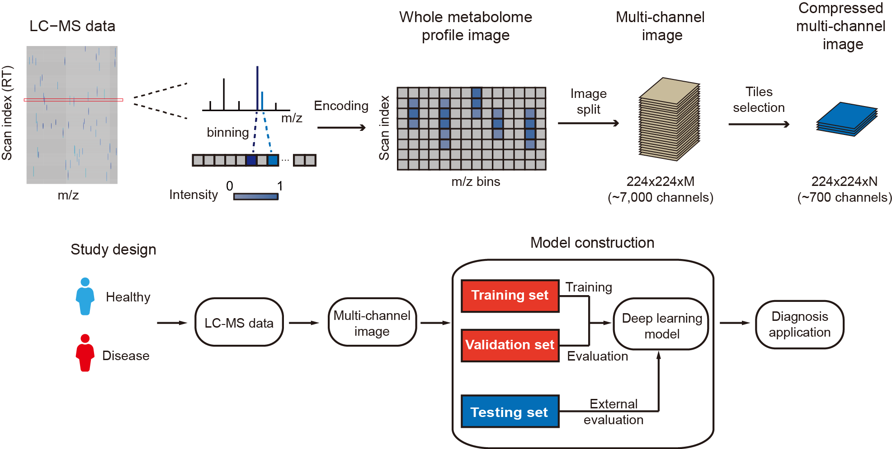

# MetImage

LC−MS-based Untargeted Metabolomics Data into Images towards AI-based Clinical Diagnosis


<div align=center></div>

## About
MetImage is a python based approach to convert LC–MS-based untargeted metabolomics data into digital images. MetImage encoded the raw LC–MS data into multi-channel images, and each image retained the characteristics of mass spectra from the raw LC–MS data. MetImage can build diagnose model by multi-channel images with deep learning model.

## Table of Contents
- [Workflow](#workflow)
- [Install](#install)
- [Usage](#usage)
	- [Quick Start](#Quick Start)
    - [Manual](#Manual)
- [Maintainers](#maintainers)
- [Citation](#Citation)
- [License](#license)

# Workflow
<div align=center></div>

# Install
You can install `MetImage` from [Github](https://github.com/ZhuMetLab/metimage).

```sh
$ git clone https://github.com/ZhuMetLab/metimage.git
```

# Usage

### Quick Start
MetImage provided a trained model to distinguish pre-screening positive subjects (PRCS) from healthy controls (HC), 
according to diagnosis of endoscopy with iodine in a esophageal squamous cell carcinoma (ESCC) early screening cohort.
The demo dataset contains raw LC-MS data (.mzXML) from 10 PRCS and 10 HC.

To use demo ESCC disease diagnosis model in MetImage, please use following codes:

```sh
$ pip show metimage
# move to pathway of MetImage
$ python /demo/demo.py 
```

### Manual
For detailed usage, please refer to [manual](manual.ipynb) of MetImage.

# Maintainers
[@Hongmiao Wang](https://github.com/waterom)

# Citation
This free open-source software implements academic research by the authors and co-workers. If you use it, please support the project by citing the appropriate journal articles.
Hongmiao Wang, Yandong Yin, and Zheng-Jiang Zhu*, Metabolite annotation from knowns to unknowns through knowledge-guided multi-layer metabolic network, Submitted, 2022.

# License
<a rel="license" href="https://creativecommons.org/licenses/by-nc-nd/4.0/"></a> 
This work is licensed under the Attribution-NonCommercial-NoDerivatives 4.0 International (CC BY-NC-ND 4.0)
